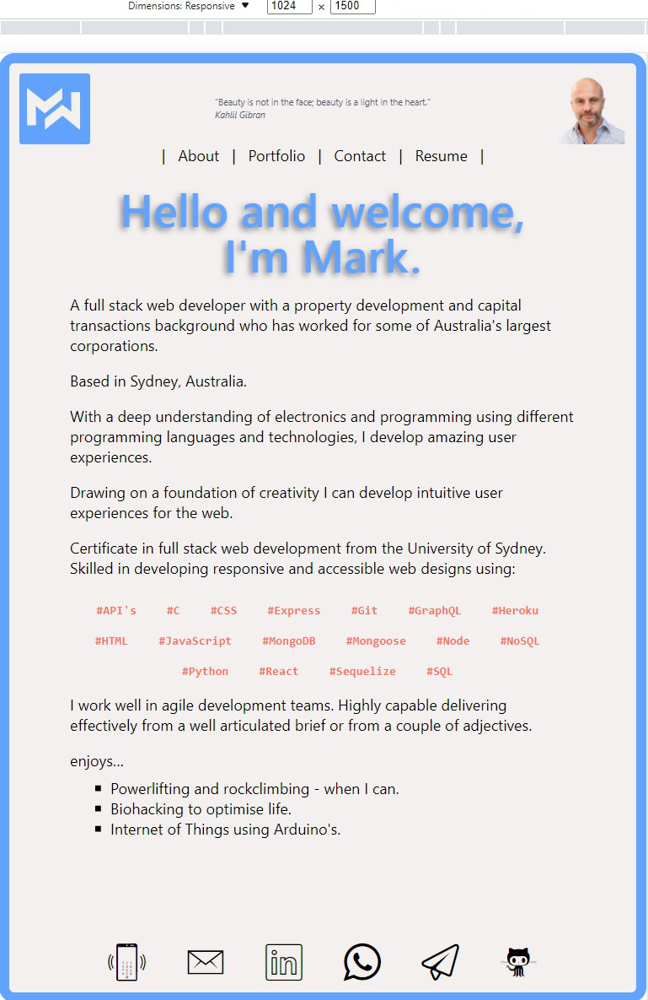
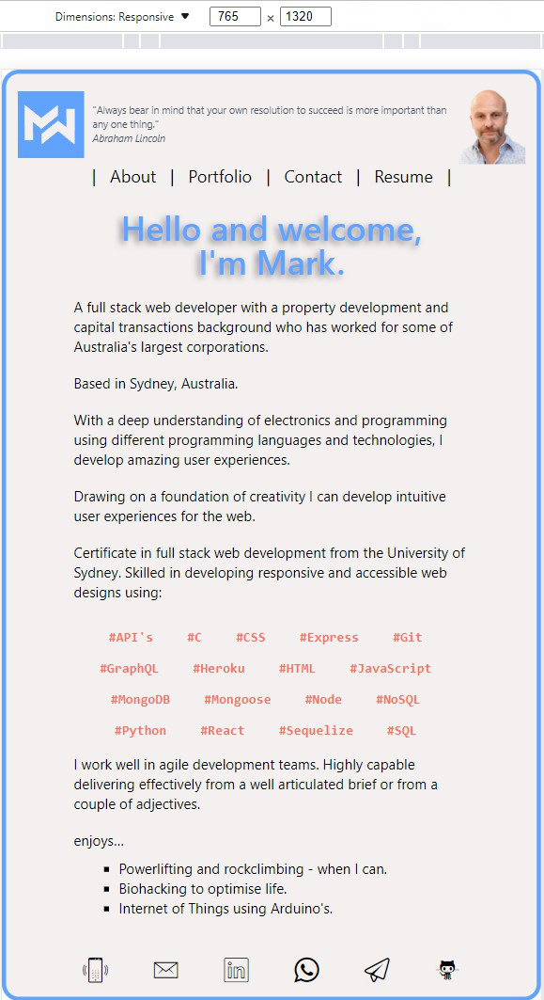
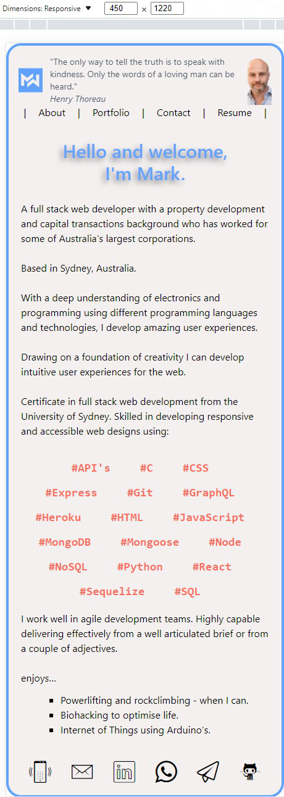

[](https://get.watsonised.com)  [](https://github.com/Mark33Mark/fsf-dev-portfolio-3) 

# USYD-FSF Week 20 Project   
 
## React Portfolio

### Table of Contents  
  
   1. [Project Description](#1-description)
   2. [Application Features](#2-features)
   3. [Installation](#3-installation)
   4. [Usage](#4-usage)
   5. [Credits](#5-credits)
   6. [License](#6-license)
   7. [Repository Status](#7-github-repo-status)
   8. [Contribute](#8-how-to-contribute)
   9. [Tests](#9-tests)
   10. [Checklist](#10-checklist)

---

### 1. Description  

**What is this project?**  

*  A portfolio application programmed using the React JavaScript library, thanks Facebook (now Meta) for developing React:
   
   [My Portfolio developed with React:  get.watsonised.me](https://get.watsonised.me)  
   
 
**Why this project?**  

* As a web developer you're part of a community and a well setup portfolio page is an important place to share your projects and help you with applying for jobs or working as a freelancer but also to share your work with other developers and collaborate on projects.

*  This portfolio demonstrates some of my new React skills to help set me apart from other developers whose portfolios don’t use the latest technologies.

**What problem does this project solve?**  

* Uses current technologies to demonstrate some of my React skills.

**Lessons learnt?**  

* You need to have a good plan to set out the structure / modules for your page.  
* I'd not used Tailwind CSS before but after this project I'm a big fan.  It was reasonably simple to transition from Bootstrap to this.  It is easily configurable, well supported by an excellent on line manual and quick to implement.  
* I couldn't get Netlify to work for the form, I gave it a good try however the form for the moment is not passing through the Netlify server for handling.  Console logs a 405 server error, meaning it gets to the Netlify server but is rejected.  Most likely an issue with the way the data is being sent, I did follow Netlify's walkthrough.  Lesson here is that it wasn't as straightforward as Netlify will have you believe, particularly for React development.
* React is amazingly flexible with how you can handle some processes.  For example this portfolio has 3 different methods for handling icons, Heroicons and Icomoon.  Another example is the many styling methods available.  

---

### 2. Features  

The portfolio satisfies all of the user acceptance criteria as listed in the [Checklist](#10-checklist) below.  


### Responsiveness:  

#### Large Screens



#### Medium Screens



#### Small Screens



---

### 3. Installation

You are welcome to download the source code from [my Github repository](https://github.com/Mark33Mark/fsf-dev-portfolio-3)  

Once downloaded, you will need to install the dependencies with the following command in your terminal:  

```npm install```  

If you want to generate a deploy ready set of minimised (unreadable) code then you will need to run in the command line:  

```npm run build```  

To run the application, type in the command line:

```npm start```  

Enjoy.  

---

### 4. Usage  

The code can be downloaded from [my Github repository](https://github.com/Mark33Mark/fsf-dev-portfolio-3) for all assets created for the project.  

You can modify the code as you need.

---

### 5. Credits  

*  React online documentation,
*  Stack Overflow forums,
*  Tailwind online documentation,
*  https://www.freecodecamp.org/news/build-portfolio-website-react/
*  https://ibaslogic.com/react-tutorial-for-beginners/
*  https://justinramel.com/how-to-use-heroicons-in-your-react-app

---

### 6. License  

 The works in this repository are subject to:  

[](doc/LICENSE.md)

---

### 7. Github repo status  


---

### 8. How to Contribute  

 If you would like to contribute, please comply with the Contributor Covenant Code of Conduct:  

[](doc/code_of_conduct.md)

---

### 9. Tests  

* No unit tests have been written for this application.  

---

### 10. Checklist  

 All actions not checked are still to be completed:  

[x]  Satisfies the acceptance criteria:  
   *   Application is a single-page app for a web developer's portfolio.  
   *   Loading the portfolio, presents the user with a page containing a header, a section for content, and a footer.  
   *   The header has the developer's name and navigation with titles corresponding to different sections of the portfolio.  
   *   The navigation titles, presents the user with the titles: About Me, Portfolio, Contact, and Resume, and the  
title corresponding to the current section is highlighted.
   *  Selecting a navigation title presents the user with the corresponding section below the navigation without the page reloading and that title is highlighted.  
   *  Loading the portfolio for the first time then the About Me title and section are selected by default.  
   *  The About Me has a recent photo or avatar of the developer and a short bio about them.  
   *  The Portfolio section has titled images of six of the developer’s applications with links to both the  
deployed applications and the corresponding GitHub repositories.  
   *  The Contact section has a contact form with fields for a name, an email address, and a message.  
   *  Moving my cursor out of one of the form fields without entering text, a notification that this field is required.  
   *  Entering text into the email address field a notification is issued if an invalid email address is entered.  
   *  The Resume section has a link to a downloadable resume and a list of the developer’s proficiencies  
   *  The footer has text or icon links to the developer’s GitHub and LinkedIn profiles, and their profile on a third platform (Stack Overflow, Twitter).  
[x]  Application must use React to render content.  
[x]  Application has a single Header component that appears on multiple pages, with a Navigation component within it that’s used to conditionally render About Me, Portfolio, Contact, and Resume sections.  
[x]  Application has a single Project component that’s used multiple times in the Portfolio section.  
[x]  Application has a single Footer component that appears on multiple pages.  
[x]  Application is deployed to GitHub Pages, [get.watsonised.com](https://get.watsonised.com)
[x]  Application loads with no errors.  
[x]  Github repository contains application code: [Github location: https://github.com/Mark33Mark/fsf-dev-portfolio-3](https://github.com/Mark33Mark/fsf-dev-portfolio-3)  
[x]  GitHub repo contains all application code.  
[x]  User experience is intuitive and easy to navigate.  
[x]  User interface style is clean and polished.  
[x]  Application uses a color scheme other than the default Bootstrap color palette.  
[x]  Repository has a unique name.  
[x]  Repository follows best practices for file structure and naming conventions.  
[x]  Repository follows best practices for class/id naming conventions, indentation, quality comments, etc.  
[x]  Repository contains multiple descriptive commit messages.  
[x]  Repository contains quality README file with description, screenshot, and link to deployed application.  

---

[Back to the top](#usyd-fsf-week-20-project)  
